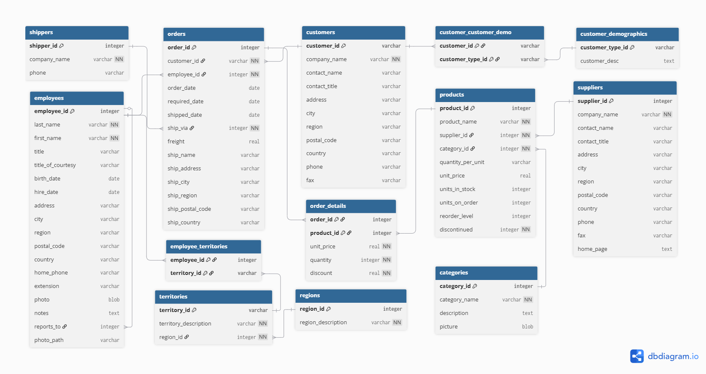

# Northwind Traders -- End-to-End ELT Pipeline


An end-to-end ELT pipeline built on the Northwind Traders database, covering data extraction, loading, transformation, and visualization through a final dashboard.

---

## Table of Contents

- [Description](#description)
- [Overview](#overview)
- [Dataset](#dataset)
- [Tech Stack](#tech-stack)
- [Architecture](#architecture)
- [Pipeline](#pipeline)
  - [Extraction \& Loading](#extraction--loading)
  - [Transformation](#transformation)
- [Data Quality](#data-quality)
  - [Test Types](#test-types)
  - [Business Rules](#business-rules)
- [dbt Models](#dbt-models)
  - [Staging Models](#staging-models-13)
  - [Intermediate Models](#intermediate-models-3)
  - [Marts Models](#marts-models-8)
- [Getting Started](#getting-started)
  - [Prerequisites](#prerequisites)
  - [Installation](#installation)
  - [Configuration](#configuration)
  - [Running the Pipeline](#running-the-pipeline)
- [Project Structure](#project-structure)
- [Dashboard](#dashboard)

---

## Description

This project implements a fully functional ELT (Extract, Load, Transform) data pipeline using the Northwind Traders database as the data source. The pipeline ingests raw data into Databricks, transforms it following the Medallion Architecture using dbt, and delivers analytical models ready for dashboard consumption in Power BI.

The Northwind Traders database contains sales data from a fictional company that imports and exports specialty foods worldwide. It covers business domains including customers, employees, orders, products, suppliers, and shipping operations.

---

## Overview

This project demonstrates modern data engineering practices by building a complete ELT pipeline from raw data to actionable insights. The key components include:

- **Data Ingestion**: PySpark scripts load raw SQLite data into Delta Tables on Databricks
- **Data Transformation**: dbt applies business logic across three layers (staging, intermediate, marts)
- **Data Quality**: Comprehensive tests ensure data integrity and business rule compliance
- **Data Visualization**: Power BI dashboards consume the final Star Schema models

---

## Dataset

The **Northwind Traders** database is a classic sample dataset used for learning and demonstration purposes. It represents a fictional specialty foods import/export company with the following business domains:

| Domain | Description |
|--------|-------------|
| **Customers** | Customer records with contact information and demographic data |
| **Employees** | Employee records with job titles and territory assignments |
| **Orders** | Sales orders with line items, shipping details, and freight costs |
| **Products** | Product catalog with categories, suppliers, and inventory data |
| **Suppliers** | Supplier information for product sourcing |
| **Shipping** | Shipping carriers and delivery information |
| **Geography** | Regions and territories for sales organization |

The database consists of **13 source tables** that are ingested into the raw layer and transformed through the pipeline.



---

## Tech Stack

| Tool | Purpose |
|---|---|
| **Databricks** | Cloud data platform and compute engine |
| **PySpark** | Raw data ingestion and Delta Table creation |
| **dbt** | Data transformation, modeling, and testing |
| **SQL** | Querying and business logic |
| **Python** | Supporting scripts and automation |
| **Power BI** | Dashboard and data visualization |

---

## Architecture

The project follows the **Medallion Architecture**, organized across three transformation layers inside Databricks:

```
northwind_raw_data          # Raw ingestion layer
└── source_sql_db

northwind_dev               # Development environment
└── dev_akilas_rocha

northwind_prod              # Production environment
├── staging                 # Cleaned and typed source tables
├── intermediate            # Business logic and complex joins
└── marts                   # Fact and dimension tables (Star Schema)
```

---

## Pipeline

### Extraction & Loading

The source data is provided as a **SQLite file**, which is manually uploaded to a **Databricks Volume**. From there, a **PySpark script** reads the files and writes them to the `northwind_raw_data.source_sql_db` schema as **Delta Tables**.

```
SQLite file
    └── Manual upload to Databricks Volume
            └── PySpark ingestion script
                    └── Delta Tables -> northwind_raw_data.source_sql_db
```

### Transformation

Transformations are handled by **dbt**, following the three layers of the Medallion Architecture:

#### Staging

- Standardizes column naming for better readability
- Applies `CAST` to enforce proper data types
- One model per source table -- no joins at this layer

#### Intermediate

- Prepares data for the Marts layer
- Handles complex multi-table joins
- Applies business rules and derived calculations

#### Marts

- Contains **Fact** and **Dimension** tables modeled as a **Star Schema**
- Designed to serve analytical queries and dashboard consumption

```
Raw (Delta Tables)
    └── Staging
        └── Intermediate
            └── Marts
```

---

## Data Quality

Data quality is enforced through **dbt tests** defined in YAML configuration files. These tests run automatically during each dbt execution and ensure the integrity and accuracy of the data pipeline.

### Test Types

| Test Type | Description | Example |
|-----------|-------------|---------|
| `unique` | Ensures column values are unique | Primary keys like `order_detail_id` |
| `not_null` | Ensures column values are not null | Required fields like `order_id`, `product_id` |
| `relationships` | Validates foreign key integrity | `customer_id` references valid customers |
| `accepted_values` | Ensures values match a defined list | `inventory_status` values |
| `expression_is_true` | Validates custom business expressions | `unit_price >= 0`, `quantity > 0` |
| `dbt_expectations.expect_column_values_to_be_between` | Validates value ranges | `discount` between 0 and 1 |

The project uses the following dbt packages for extended testing:

- **dbt_utils**: Provides `expression_is_true` for custom validation expressions
- **dbt_expectations**: Provides `expect_column_values_to_be_between` for range validations

### Business Rules

The following business rules are enforced through dbt tests to ensure data integrity:

| Table | Rule | Test Implementation |
|-------|------|---------------------|
| `order_detail` | Discount must be between 0 and 1 (0% to 100%) | `dbt_expectations.expect_column_values_to_be_between(min_value: 0, max_value: 1)` |
| `order_detail` | Quantity must be greater than zero | `dbt_utils.expression_is_true: "quantity > 0"` |
| `product` | Unit price cannot be zero | `dbt_utils.expression_is_true: "unit_price >= 0"` |
| `product` | Units in stock cannot be negative | `dbt_utils.expression_is_true: "units_in_stock >= 0"` |

These tests are defined in the model YAML files (e.g., `stg__northwind_order_detail.yml`, `int__order_detail.yml`) and run with every `dbt run` or `dbt test` execution.

---

## dbt Models

### Staging Models (13)

One-to-one mapping with source tables. Standardizes naming conventions and enforces data types.

| Model | Description |
|-------|-------------|
| `stg__northwind_category` | Product categories |
| `stg__northwind_customer` | Customer records |
| `stg__northwind_customer_customer_demo` | Customer demographic associations |
| `stg__northwind_customer_demographic` | Customer demographic segments |
| `stg__northwind_employee` | Employee records |
| `stg__northwind_employee_territory` | Employee-territory assignments |
| `stg__northwind_order` | Sales orders |
| `stg__northwind_order_detail` | Order line items |
| `stg__northwind_product` | Product catalog |
| `stg__northwind_region` | Sales regions |
| `stg__northwind_shipper` | Shipping carriers |
| `stg__northwind_supplier` | Suppliers |
| `stg__northwind_territory` | Territory definitions |

### Intermediate Models (3)

Business logic and complex joins preparing data for the Marts layer.

| Model | Description |
|-------|-------------|
| `int__order_detail` | Order details enriched with business rules and joins |
| `int__product` | Product data with inventory and pricing validations |
| `int__inventory_management` | Inventory metrics and reconciliation logic |

### Marts Models (8)

Fact and Dimension tables forming the Star Schema for analytical consumption.

| Model | Type | Description |
|-------|------|-------------|
| `fct__order` | Fact | Core sales fact table at order line-item level |
| `dim__customer` | Dimension | Customer dimension |
| `dim__employee` | Dimension | Employee dimension |
| `dim__product` | Dimension | Product dimension |
| `dim__shipper` | Dimension | Shipper dimension |
| `dim__supplier` | Dimension | Supplier dimension |
| `dim__territory` | Dimension | Territory dimension |
| `dim__date` | Dimension | Date dimension |

---

## Getting Started

### Prerequisites

- **Databricks** workspace with cluster access
- **Python 3.8+** installed
- **dbt** installed (version 1.7.0 or higher)
- **Power BI Desktop** (for dashboard development)

### Installation

1. Clone the repository:

```bash
git clone https://github.com/your-username/northwind-elt.git
cd northwind-elt
```

2. Create a virtual environment and install dependencies:

```bash
python -m venv venv
source venv/bin/activate  # Linux/Mac
pip install -r requirements.txt
```

### Configuration

1. Copy the example environment file:

```bash
cp example.env .env
```

2. Edit `.env` with your Databricks credentials:

```bash
# Development environment
export DEV_DATABRICKS_CATALOG="<your-catalog>"
export DEV_DATABRICKS_HOST="<your-host>"
export DEV_DATABRICKS_HTTP_PATH="<your-http-path>"
export DEV_DATABRICKS_TOKEN="<your-token>"
export DEV_SCHEMA_NAME="<your-schema>"
```

3. Install dbt packages:

```bash
cd dbt
dbt deps
```

### Running the Pipeline

1. **Ingest raw data** -- Run the PySpark notebook in Databricks:
   - Upload `northwind_data/Northwind_db.sqlite` to a Databricks Volume
   - Execute `notebooks/ingestion_raw_tables.ipynb`

2. **Run dbt transformations**:

```bash
cd dbt

# Run staging models
dbt run --select staging

# Run intermediate models
dbt run --select intermediate

# Run marts models
dbt run --select marts

# Or run all models
dbt run
```

3. **Run data quality tests**:

```bash
dbt test
```

4. **Generate documentation** (optional):

```bash
dbt docs generate
dbt docs serve
```

---

## Project Structure

```
northwind-elt/
├── dbt/                              # dbt project (models, tests, configs)
│   └── models/
│       ├── staging/                  # stg_* models -- typed and renamed source tables
│       ├── intermediate/             # int_* models -- joins and business logic
│       └── marts/                    # fct_* and dim_* models -- Star Schema
├── northwind_data/
│   └── Northwind_db.sqlite           # Source SQLite database
├── notebooks/
│   └── ingestion_raw_tables.ipynb    # PySpark ingestion notebook
├── setup/
│   ├── setup_catalogs_squemas.sql    # Catalog and schema setup
│   └── setup_secrets_scope.ipynb     # Databricks secrets configuration
├── example.env                       # Environment variables template
├── .gitignore
├── requirements.txt
└── README.md
```

---

## Dashboard

The final layer of the pipeline is a **Power BI** dashboard connected to the Marts layer. It consumes the Star Schema models to deliver business insights on sales performance, customer behavior, product trends, and operational metrics.
